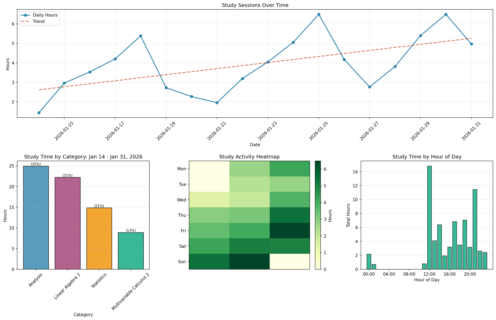

```
   ______      __
  / ____/_  __/ /_  ___  ____________  _______
 / /   / / / / __ \/ _ \/ ___/ ___/ / / / __ \
/ /___/ /_/ / /_/ /  __/ /  (__  ) /_/ / / / /
\____/\__, /_.___/\___/_/  /____/\__, /_/ /_/
     /____/                     /____/
```

CLI study tracker and timer with analytics. Track your sessions, visualize your progress.



## Philosophy

Terminal level control, system notifications, local data. Focus is the feature.

## Requirements

- Python 3.12+
- Linux (uses `notify-send` and `xdg-open`)
- [uv](https://github.com/astral-sh/uv) package manager

## Tech Stack

- CLI: Typer
- Database: SQLite + SQLAlchemy
- Data: Pydantic models
- Analytics: Matplotlib + NumPy
- Notifications: libnotify (notify-send)

## Setup

```bash
uv sync
```

Add alias to your shell config (~/.bashrc or ~/.zshrc):

```bash
alias cybersyn="uv run --directory /path/to/cybersyn main.py"
```

Replace `/path/to/cybersyn` with your local repo path.

Reload shell or source the config.

## Usage

### Stopwatch Mode

```bash
cybersyn start "Assignment 1" --category "Analysis 1" --week 1
```

Timer runs in foreground with live display. Press Ctrl+C to detach (timer keeps running).

```bash
cybersyn status
cybersyn pause
cybersyn resume
cybersyn stop
```

### Pomodoro Mode

```bash
cybersyn start "Preread chapter 15.1" --category "Multivariable Calclus 2" --week 1 --pomodoro
```

Auto-cycles through work/break periods with notifications.

Default: 25min work, 5min short break, 15min long break (every 4 sessions).

```bash
cybersyn config
cybersyn config --work 30 --short-break 10
cybersyn config --long-break 20 --sessions 3
```

### View Sessions

```bash
cybersyn list
cybersyn list --limit 20
```

### Delete Sessions

```bash
cybersyn delete <session_id>
cybersyn delete <session_id> --force
```

Permanently delete a session. Shows session details and asks for confirmation (skip with `--force`). Use `cybersyn list` to find session IDs.

### Statistics

```bash
cybersyn stats
cybersyn stats --days 7
```

Shows session count, total time, breakdown by category.

### Charts

```bash
cybersyn charts
cybersyn charts --dashboard
cybersyn show
```

Generates 4 visualizations:
- Time series with trend line
- Category breakdown with percentages
- Activity heatmap
- Time-of-day analysis

Dashboard flag generates a single combined view.

### Add Historical Sessions

```bash
cybersyn add "Past study session" --category "Math" --week 1 --duration 120
cybersyn add "Session from yesterday" -c "Physics" -w 2 -d 90 --date 2026-01-31
```

Manually add completed sessions. Duration in minutes, date defaults to today.

### Export

```bash
cybersyn export
cybersyn export backup.csv
```

## Data

- Database: `data/cybersyn.db`
- State: `data/state.json`
- Config: `data/config.json`
- Charts: `data/charts/`

## Help

```bash
cybersyn --help
cybersyn start --help
```
